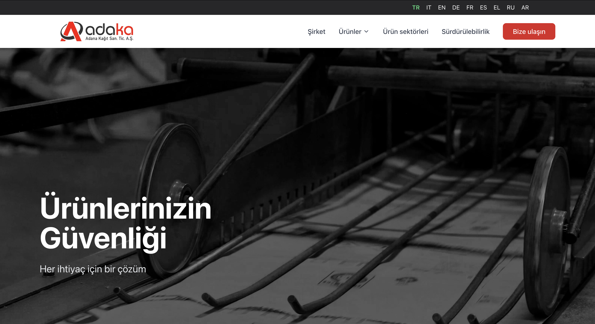

# Adaka – AI-Enhanced Landing Page

Adaka is a clean, responsive landing page project built with **Next.js** and **Tailwind CSS**, designed for modern company websites. It focuses on performance, SEO, internationalization, and accessibility. The project is structured with scalability and feature extension in mind — including upcoming **AI-generated news highlights**.

---

## 🚀 Features

- ⚡️ **Next.js** (App Router) for high performance and scalability
- 🎨 **Tailwind CSS** for fast and clean UI development
- 🌍 **Internationalization (i18n)** via `next-intl`
- 📱 Fully **responsive design**
- 🧠 **AI-Generated News Section** _(coming soon)_
- 🔍 Built-in **SEO support** with custom meta handling
- 📄 Semantic HTML and **accessibility** best practices
- 🔧 Modular folder and component architecture

---

## 📸 Demo

Live demo: [https://adaka-demo.netlify.app]



---

## 🧠 Upcoming AI Feature

> We're integrating a dynamic **AI-generated news module**, which will fetch short daily summaries from public news APIs and summarize them using GPT-4 for contextual display on the homepage.

---

## 🛠️ Tech Stack

- **Framework:** Next.js 14
- **Styling:** Tailwind CSS, CSS Modules
- **i18n:** next-intl
- **SEO:** `next/head` + dynamic meta
- **AI (Upcoming):** OpenAI API, NewsAPI/GNews (TBD)

---

## 📁 Folder Structure

```
adaka/
├── app/
│   └── [locale]/page.tsx      # i18n routing
├── components/
│   └── Header, Footer, News, etc.
├── lib/                       # Utilities
├── public/                    # Static files
├── styles/
├── i18n/
└── ...
```

---

## 🧪 To Run Locally

```bash
git clone https://github.com/korayuymaz/adaka.git
cd adaka
npm install
npm run dev
```

Then open `http://localhost:3000` in your browser.

---

## 📄 License

MIT © [Koray Uymaz](https://github.com/korayuymaz)
